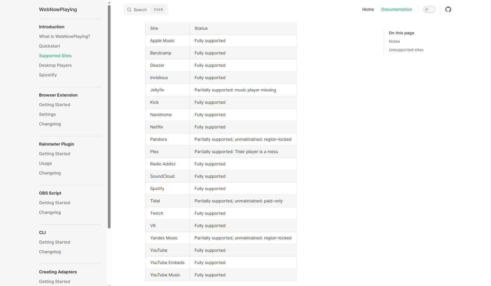
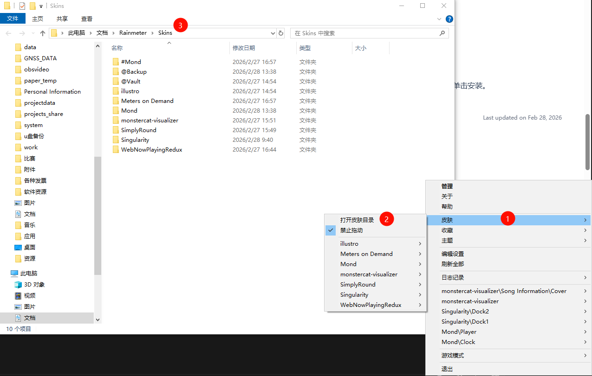
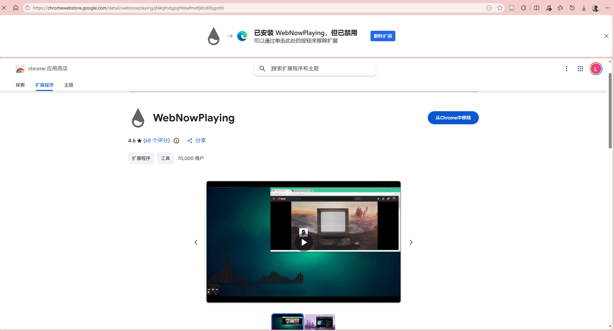
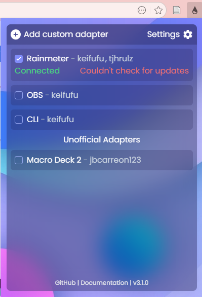
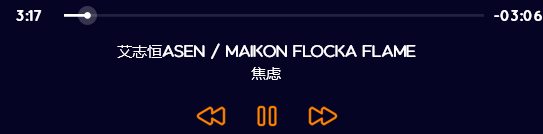
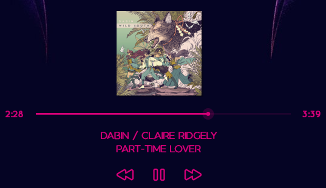
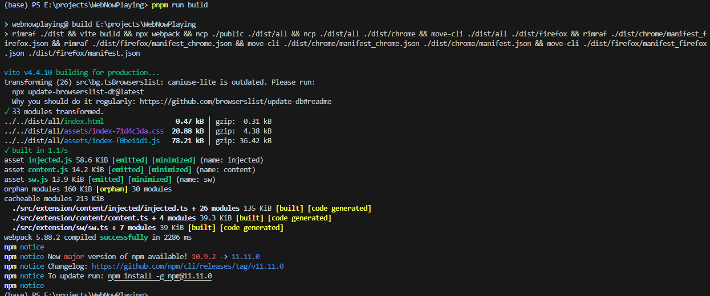
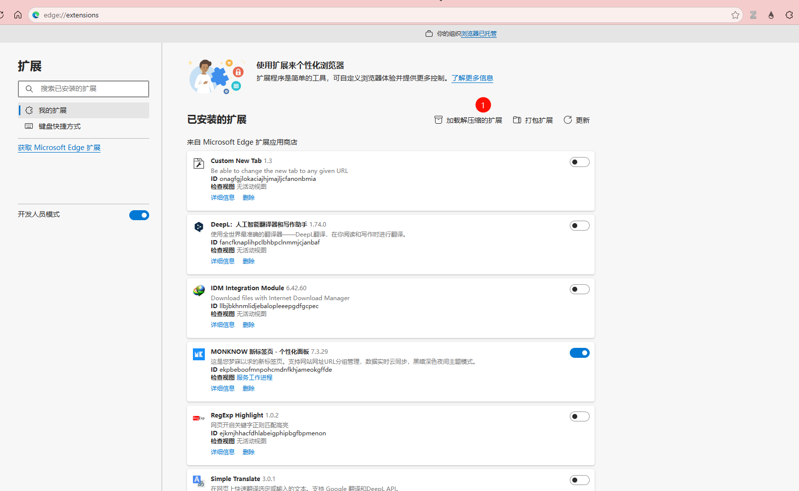
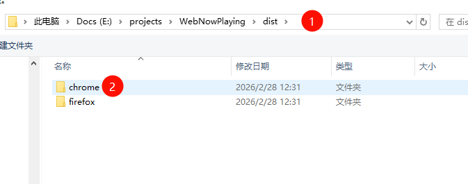

<!--more-->
## 效果展示

<video controls src="2026-02-28 14-07-09.mp4" title="Rainmeter Daft Punk主题"></video>

## 背景

Rainmeter极其轻量便携，允许用户自定义桌面组件，实现美观简洁的高度定制化。其中有Mond这样的出彩并被用户广泛使用的主题，其中的Music Player功能就是亮点。

由于Mond这样的主题开发时间非常早（2019甚至更早），到现在长期无人维护，导致其无法适应现代流媒体播放器。追溯其原因，Mond 的 Music Player 功能依赖 Rainmeter 自带的 NowPlaying 插件。
NowPlaying 主要通过读取本地播放器（如 Winamp、iTunes、AIMP）的 API 或系统接口来获取播放信息。
但现代流媒体平台（Spotify Web、YouTube、网易云 Web）运行在浏览器沙箱环境中，并不会暴露传统播放器接口，因此 NowPlaying 无法获取播放状态。

早已有人注意到这样的问题，因此推出了WebNowPlaying这样更为现代化的插件作为解决方案([Github: WebNowPlaying browser extension](https://github.com/keifufu/WebNowPlaying))。WebNowPlaying的官方文档中给出了其支持的流媒体播放平台，如下图所示。


支持列表中并没有国内的平台，如网易云音乐等。于是乎我准备自己进行二次开发以适配网易云的Web端。

## 开发过程

### Rainmeter的Mond的基础配置
下载好Rainmeter后，可以从[Visual Skins](https://visualskins.com/skin/mond)官方下载Mond的皮肤并单击安装。

安装完成后，右击Rainmeter小图标，点击“皮肤-打开皮肤目录”，再打开Mond的皮肤根目录，找到`Mond\@Resources\Variables.inc`。



默认的Variables.inc的内容为：

```
[Variables]

Language=English
Location=SPXX0050
Unit=m
ScrollMouseIncrement=0.1
Format=H
Hidden=0
Hidden2=1
Player=Winamp

TextColor=255,255,255
ButtonColor=250,126,0
```

将其"Player"项修改为WebNowPlaying，即
```
[Variables]

Language=English
Location=SPXX0050
Unit=m
ScrollMouseIncrement=0.1
Format=H
Hidden=0
Hidden2=1
Player=WebNowPlaying

TextColor=255,255,255
ButtonColor=250,126,0
```

继续找到`Mond\Player.ini`，其原始内容为：

```
[Rainmeter]
Update=100
Author=Connect-R
BackgroundMode=2
SolidColor=0,0,0,1
DynamicWindowSize=1
AccurateText=1
MouseScrollUpAction=[!SetVariable Scale "(#Scale#+#ScrollMouseIncrement#)"][!WriteKeyValue Variables Scale "(#Scale#+#ScrollMouseIncrement#)"][!Refresh]
MouseScrollDownAction=[!SetVariable Scale "(#Scale#-#ScrollMouseIncrement# < 1 ? 1 : #Scale#-#ScrollMouseIncrement#)"][!WriteKeyValue Variables Scale "(#Scale#-#ScrollMouseIncrement# < 1 ? 1 : #Scale#-#ScrollMouseIncrement#)"][!Refresh]

[Variables]
@include=#@#Variables.inc
Scale=2.5

;-------------------------------------------------------------
;-------------------------------------------------------------

[MeasureArtist]
Measure=Plugin
Plugin=NowPlaying.dll
PlayerName=#Player#
PlayerType=ARTIST
Substitue="":""

[MeasureTitle]
Measure=Plugin
Plugin=NowPlaying.dll
PlayerName=#Player#
PlayerType=TITLE
Substitue="":""

[MeasureAlbum]
Measure=Plugin
Plugin=NowPlaying.dll
PlayerName=#Player#
PlayerType=ALBUM
Substitue="":""

[MeasureProgress]
Measure=Plugin
Plugin=NowPlaying.dll
PlayerName=#Player#
PlayerType=PROGRESS

[MeasureDuration]
Measure=Plugin
Plugin=NowPlaying.dll
PlayerName=#Player#
PlayerType=DURATION

[MeasurePosition]
Measure=Plugin
Plugin=NowPlaying.dll
PlayerName=#Player#
PlayerType=POSITION

[MeasureStateButton]
Measure=Plugin
Plugin=NowPlaying.dll
PlayerName=#Player#
PlayerType=STATE
Substitute="0":"#@#Play.png","1":"#@#Pause.png","2":"#@#Play.png"

[MeasureMinutesRemaining]
Measure=Calc
Formula=Trunc((MeasureDuration - MeasurePosition)/60)
RegExpSubstitute=1
Substitute="^(.)$":"0\1"

[MeasureSecondsRemaining]
Measure=Calc
Formula=((MeasureDuration - MeasurePosition) % 60)
RegExpSubstitute=1
Substitute="^(.)$":"0\1"

;-------------------------------------------------------------
;-------------------------------------------------------------

[MeterArtist]
Meter=String
MeasureName=MeasureArtist
StringAlign=Center
StringCase=Upper
FontFace=Aquatico
FontColor=#TextColor#
FontSize=(4*#Scale#)
X=(95*#Scale#)
Y=(15*#Scale#)
Text="%1"
AntiAlias=1

[MeterTitle]
Meter=String
MeasureName=MeasureTitle
StringAlign=Center
StringCase=Upper
FontFace=Aquatico
FontColor=#TextColor#
FontSize=(4*#Scale#)
X=(95*#Scale#)
Y=(8*#Scale#)r
Text="%1"
AntiAlias=1

[MeterDuration]
Meter=String
MeasureName=MeasureDuration
StringAlign=Center
FontFace=Quicksand
FontColor=#TextColor#
FontSize=(4*#Scale#)
X=(10*#Scale#)
Y=(2.5*#Scale#)
Text="%1"
AntiAlias=1

[MeterPosition]
Meter=String
MeasureName=MeasureMinutesRemaining
MeasureName2=MeasureSecondsRemaining
StringAlign=Center
FontFace=Quicksand
FontColor=#TextColor#
FontSize=(4*#Scale#)
X=(185*#Scale#)
Y=(2.5*#Scale#)
Text="-%1:%2"
AntiAlias=1

;-------------------------------------------------------------
;-------------------------------------------------------------

[MeterBar]
Meter=Shape
X=(23*#Scale#)
Y=(5*#Scale#)
Shape=Rectangle 0,0,(150*#Scale#),(1*#Scale#),0 | Fill Color #TextColor#,30 | StrokeWidth 0
Shape2=Rectangle 0,0,([MeasureProgress]*1.5*#Scale#),(1*#Scale#),0 | Fill Color #TextColor# | StrokeWidth 0
Shape3=Ellipse ([MeasureProgress]*1.5*#Scale#),(0.5*#Scale#),(1.2*#Scale#) |Fill Color #TextColor# | StrokeWidth 0
Shape4=Ellipse ([MeasureProgress]*1.5*#Scale#),(0.5*#Scale#),(3.4*#Scale#) |Fill Color #TextColor#,50 | StrokeWidth 0
DynamicVariables=1
LeftMouseUpAction=[!CommandMeasure "MeasureProgress" "SetPosition $MouseX:%$"]

;-------------------------------------------------------------
;-------------------------------------------------------------

[MeterPrevious]
Meter=Image
ImageName=#@#Previous.png
X=(69*#Scale#)
Y=(35*#Scale#)
W=(13*#Scale#)
AntiAlias=1
ImageTint=#ButtonColor#
SolidColor=0,0,0,1
LeftMouseUpAction=[!PluginBang "MeasureStateButton Previous"]

[MeterPlayPause]
Meter=Image
ImageName=[MeasureStateButton]
X=(20*#Scale#)r
Y=(0*#Scale#)r
W=(13*#Scale#)
AntiAlias=1
SolidColor=0,0,0,1
ImageTint=#ButtonColor#
DynamicVariables=1
LeftMouseUpAction=[!CommandMeasure "MeasureStateButton" "PlayPause"]

[MeterNext]
Meter=Image
ImageName=#@#Next.png
X=(20*#Scale#)r
Y=(0*#Scale#)r
W=(13*#Scale#)
AntiAlias=1
ImageTint=#ButtonColor#
SolidColor=0,0,0,1
LeftMouseUpAction=[!PluginBang "MeasureStateButton Next"]
```

应该将所有的`Plugin=NowPlaying.dll`修改为`Plugin=WebNowPlaying`，即修改为：

```
[Rainmeter]
Update=100
Author=Connect-R
BackgroundMode=2
SolidColor=0,0,0,1
DynamicWindowSize=1
AccurateText=1
MouseScrollUpAction=[!SetVariable Scale "(#Scale#+#ScrollMouseIncrement#)"][!WriteKeyValue Variables Scale "(#Scale#+#ScrollMouseIncrement#)"][!Refresh]
MouseScrollDownAction=[!SetVariable Scale "(#Scale#-#ScrollMouseIncrement# < 1 ? 1 : #Scale#-#ScrollMouseIncrement#)"][!WriteKeyValue Variables Scale "(#Scale#-#ScrollMouseIncrement# < 1 ? 1 : #Scale#-#ScrollMouseIncrement#)"][!Refresh]

[Variables]
@include=#@#Variables.inc
Scale=2.5

;-------------------------------------------------------------
;-------------------------------------------------------------

[MeasureArtist]
Measure=Plugin
Plugin=WebNowPlaying
PlayerName=#Player#
PlayerType=ARTIST
Substitue="":""

[MeasureTitle]
Measure=Plugin
Plugin=WebNowPlaying
PlayerName=#Player#
PlayerType=TITLE
Substitue="":""

[MeasureAlbum]
Measure=Plugin
Plugin=WebNowPlaying
PlayerName=#Player#
PlayerType=ALBUM
Substitue="":""

[MeasureProgress]
Measure=Plugin
Plugin=WebNowPlaying
PlayerName=#Player#
PlayerType=PROGRESS

[MeasureDuration]
Measure=Plugin
Plugin=WebNowPlaying
PlayerName=#Player#
PlayerType=DURATION

[MeasurePosition]
Measure=Plugin
Plugin=WebNowPlaying
PlayerName=#Player#
PlayerType=POSITION

[MeasureStateButton]
Measure=Plugin
Plugin=WebNowPlaying
PlayerName=#Player#
PlayerType=STATE
Substitute="0":"#@#Play.png","1":"#@#Pause.png","2":"#@#Play.png"

[MeasureMinutesRemaining]
Measure=Calc
Formula=Trunc((MeasureDuration - MeasurePosition)/60)
RegExpSubstitute=1
Substitute="^(.)$":"0\1"

[MeasureSecondsRemaining]
Measure=Calc
Formula=((MeasureDuration - MeasurePosition) % 60)
RegExpSubstitute=1
Substitute="^(.)$":"0\1"

;-------------------------------------------------------------
;-------------------------------------------------------------

[MeterArtist]
Meter=String
MeasureName=MeasureArtist
StringAlign=Center
StringCase=Upper
FontFace=Aquatico
FontColor=#TextColor#
FontSize=(4*#Scale#)
X=(95*#Scale#)
Y=(15*#Scale#)
Text="%1"
AntiAlias=1

[MeterTitle]
Meter=String
MeasureName=MeasureTitle
StringAlign=Center
StringCase=Upper
FontFace=Aquatico
FontColor=#TextColor#
FontSize=(4*#Scale#)
X=(95*#Scale#)
Y=(8*#Scale#)r
Text="%1"
AntiAlias=1

[MeterDuration]
Meter=String
MeasureName=MeasureDuration
StringAlign=Center
FontFace=Quicksand
FontColor=#TextColor#
FontSize=(4*#Scale#)
X=(10*#Scale#)
Y=(2.5*#Scale#)
Text="%1"
AntiAlias=1

[MeterPosition]
Meter=String
MeasureName=MeasureMinutesRemaining
MeasureName2=MeasureSecondsRemaining
StringAlign=Center
FontFace=Quicksand
FontColor=#TextColor#
FontSize=(4*#Scale#)
X=(185*#Scale#)
Y=(2.5*#Scale#)
Text="-%1:%2"
AntiAlias=1

;-------------------------------------------------------------
;-------------------------------------------------------------

[MeterBar]
Meter=Shape
X=(23*#Scale#)
Y=(5*#Scale#)
Shape=Rectangle 0,0,(150*#Scale#),(1*#Scale#),0 | Fill Color #TextColor#,30 | StrokeWidth 0
Shape2=Rectangle 0,0,([MeasureProgress]*1.5*#Scale#),(1*#Scale#),0 | Fill Color #TextColor# | StrokeWidth 0
Shape3=Ellipse ([MeasureProgress]*1.5*#Scale#),(0.5*#Scale#),(1.2*#Scale#) |Fill Color #TextColor# | StrokeWidth 0
Shape4=Ellipse ([MeasureProgress]*1.5*#Scale#),(0.5*#Scale#),(3.4*#Scale#) |Fill Color #TextColor#,50 | StrokeWidth 0
DynamicVariables=1
LeftMouseUpAction=[!CommandMeasure "MeasureProgress" "SetPosition $MouseX:%$"]

;-------------------------------------------------------------
;-------------------------------------------------------------

[MeterPrevious]
Meter=Image
ImageName=#@#Previous.png
X=(69*#Scale#)
Y=(35*#Scale#)
W=(13*#Scale#)
AntiAlias=1
ImageTint=#ButtonColor#
SolidColor=0,0,0,1
LeftMouseUpAction=[!PluginBang "MeasureStateButton Previous"]

[MeterPlayPause]
Meter=Image
ImageName=[MeasureStateButton]
X=(20*#Scale#)r
Y=(0*#Scale#)r
W=(13*#Scale#)
AntiAlias=1
SolidColor=0,0,0,1
ImageTint=#ButtonColor#
DynamicVariables=1
LeftMouseUpAction=[!CommandMeasure "MeasureStateButton" "PlayPause"]

[MeterNext]
Meter=Image
ImageName=#@#Next.png
X=(20*#Scale#)r
Y=(0*#Scale#)r
W=(13*#Scale#)
AntiAlias=1
ImageTint=#ButtonColor#
SolidColor=0,0,0,1
LeftMouseUpAction=[!PluginBang "MeasureStateButton Next"]
```

### 安装WebNowPlaying浏览器插件

在[Chrome Extension Store](https://chromewebstore.google.com/detail/webnowplaying/jfakgfcdgpghbbefmdfjkbdlibjgnbli)或者[Github](https://github.com/keifufu/WebNowPlaying)找到WebNowPlaying的插件并安装。



成功安装后，可以在浏览器扩展区看到对应的插件图标，先将其固定在常用bar中，然后单击可以看到其显示绿色Connected。



### 测试其他流媒体网站的联通性

到现在，应该可以正确获得到Spotify或者Youtube这样平台的流媒体信息了，随意打开一个网站，然后在桌面的Player插件中检测其是否能正确显示。

如下图所示，可以看到，当前的显示方式为：左边是总时长，右边是剩余播放时间。这并不符合我们日常的使用习惯，因此我选择将其修改为：左边是已经播放的时间，右边是总时长。



对应将`Player.ini`的内容修改为：

```
[Rainmeter]
Update=100
Author=Connect-R
BackgroundMode=2
SolidColor=0,0,0,1
DynamicWindowSize=1
AccurateText=1
MouseScrollUpAction=[!SetVariable Scale "(#Scale#+#ScrollMouseIncrement#)"][!WriteKeyValue Variables Scale "(#Scale#+#ScrollMouseIncrement#)"][!Refresh]
MouseScrollDownAction=[!SetVariable Scale "(#Scale#-#ScrollMouseIncrement# < 1 ? 1 : #Scale#-#ScrollMouseIncrement#)"][!WriteKeyValue Variables Scale "(#Scale#-#ScrollMouseIncrement# < 1 ? 1 : #Scale#-#ScrollMouseIncrement#)"][!Refresh]

[Variables]
@include=#@#Variables.inc
Scale=2.8

;-------------------------------------------------------------
;-------------------------------------------------------------

[MeasureArtist]
Measure=Plugin
Plugin=WebNowPlaying
PlayerName=#Player#
PlayerType=ARTIST
Substitue="":""

[MeasureTitle]
Measure=Plugin
Plugin=WebNowPlaying
PlayerName=#Player#
PlayerType=TITLE
Substitue="":""

[MeasureAlbum]
Measure=Plugin
Plugin=WebNowPlaying
PlayerName=#Player#
PlayerType=ALBUM
Substitue="":""

[MeasureProgress]
Measure=Plugin
Plugin=WebNowPlaying
PlayerName=#Player#
PlayerType=PROGRESS

[MeasureDuration]
Measure=Plugin
Plugin=WebNowPlaying
PlayerName=#Player#
PlayerType=DURATION

[MeasurePosition]
Measure=Plugin
Plugin=WebNowPlaying
PlayerName=#Player#
PlayerType=POSITION

[MeasureStateButton]
Measure=Plugin
Plugin=WebNowPlaying
PlayerName=#Player#
PlayerType=STATE
Substitute="0":"#@#Play.png","1":"#@#Pause.png","2":"#@#Play.png"

; 已播放时间（mm:ss）
[MeasureMinutesElapsed]
Measure=Calc
Formula=Trunc(MeasurePosition / 60)
RegExpSubstitute=1

[MeasureSecondsElapsed]
Measure=Calc
Formula=Trunc(MeasurePosition % 60)
RegExpSubstitute=1
Substitute="^(.)$":"0\1"

; 总时长（mm:ss）
[MeasureMinutesDuration]
Measure=Calc
Formula=Trunc(MeasureDuration / 60)
RegExpSubstitute=1

[MeasureSecondsDuration]
Measure=Calc
Formula=Trunc(MeasureDuration % 60)
RegExpSubstitute=1
Substitute="^(.)$":"0\1"

;-------------------------------------------------------------
;-------------------------------------------------------------

[MeterArtist]
Meter=String
MeasureName=MeasureArtist
StringAlign=Center
StringCase=Upper
FontFace=Aquatico
FontColor=#TextColor#
FontSize=(4*#Scale#)
X=(95*#Scale#)
Y=(15*#Scale#)
Text="%1"
AntiAlias=1

[MeterTitle]
Meter=String
MeasureName=MeasureTitle
StringAlign=Center
StringCase=Upper
FontFace=Aquatico
FontColor=#TextColor#
FontSize=(4*#Scale#)
X=(95*#Scale#)
Y=(8*#Scale#)r
Text="%1"
AntiAlias=1

[MeterElapsed]
Meter=String
MeasureName=MeasureMinutesElapsed
MeasureName2=MeasureSecondsElapsed
StringAlign=Center
FontFace=Quicksand
FontColor=#TextColor#
FontSize=(4*#Scale#)
X=(10*#Scale#)
Y=(2.5*#Scale#)
Text="%1:%2"
AntiAlias=1

[MeterDuration]
Meter=String
MeasureName=MeasureMinutesDuration
MeasureName2=MeasureSecondsDuration
StringAlign=Center
FontFace=Quicksand
FontColor=#TextColor#
FontSize=(4*#Scale#)
X=(185*#Scale#)
Y=(2.5*#Scale#)
Text="%1:%2"
AntiAlias=1

;-------------------------------------------------------------
;-------------------------------------------------------------

[MeterBar]
Meter=Shape
X=(23*#Scale#)
Y=(5*#Scale#)
Shape=Rectangle 0,0,(150*#Scale#),(1*#Scale#),0 | Fill Color #TextColor#,30 | StrokeWidth 0
Shape2=Rectangle 0,0,([MeasureProgress]*1.5*#Scale#),(1*#Scale#),0 | Fill Color #TextColor# | StrokeWidth 0
Shape3=Ellipse ([MeasureProgress]*1.5*#Scale#),(0.5*#Scale#),(1.2*#Scale#) |Fill Color #TextColor# | StrokeWidth 0
Shape4=Ellipse ([MeasureProgress]*1.5*#Scale#),(0.5*#Scale#),(3.4*#Scale#) |Fill Color #TextColor#,50 | StrokeWidth 0
DynamicVariables=1
LeftMouseUpAction=[!CommandMeasure "MeasureProgress" "SetPosition $MouseX:%$"]

;-------------------------------------------------------------
;-------------------------------------------------------------

[MeterPrevious]
Meter=Image
ImageName=#@#Previous.png
X=(69*#Scale#)
Y=(35*#Scale#)
W=(13*#Scale#)
AntiAlias=1
ImageTint=#ButtonColor#
SolidColor=0,0,0,1
LeftMouseUpAction=[!PluginBang "MeasureStateButton Previous"]

[MeterPlayPause]
Meter=Image
ImageName=[MeasureStateButton]
X=(20*#Scale#)r
Y=(0*#Scale#)r
W=(13*#Scale#)
AntiAlias=1
SolidColor=0,0,0,1
ImageTint=#ButtonColor#
DynamicVariables=1
LeftMouseUpAction=[!CommandMeasure "MeasureStateButton" "PlayPause"]

[MeterNext]
Meter=Image
ImageName=#@#Next.png
X=(20*#Scale#)r
Y=(0*#Scale#)r
W=(13*#Scale#)
AntiAlias=1
ImageTint=#ButtonColor#
SolidColor=0,0,0,1
LeftMouseUpAction=[!PluginBang "MeasureStateButton Next"]
```
即可成功实现，如下图所示。



### 二次开发 - 添加网易云Web端的支持

#### Fork并编译现有工程

先Fork现有工程[https://github.com/keifufu/WebNowPlaying](https://github.com/keifufu/WebNowPlaying)，这里我fork到了自己的仓库：[https://github.com/BlackiePiggy/WebNowPlaying](https://github.com/BlackiePiggy/WebNowPlaying)。

然后clone到本地，即`git clone git@github.com:BlackiePiggy/WebNowPlaying.git`。

随后先进行项目的编译，看是否能成功编译。先执行`pnpm install`，再执行`pnpm run build`，执行完成后，可以得到产物在`/dist`。编译结果示例可以见下图。



构建好之后，在扩展管理页开启“开发者模式”，加载已解压的扩展，选择 dist/chrome 目录。注意添加自己编译的插件前，要先关闭或者卸载此前加载的官方的插件。





#### 添加NeteaseMusic的网站支持逻辑

此处通过观察项目
```
WebNowPlaying/
 ├─ src/
 │   ├─ extension/
 │   │   ├─ content/
 │   │   │   ├─ injected/
 │   │   │   │   ├─ sites/
 │   │   │   │   │   ├─ Spotify.ts
 │   │   │   │   │   ├─ YouTube.ts
 │   │   │   │   │   └─ NeteaseMusic.ts   ← 新增
```
里面`Spotify.ts`和`YouTube.ts`的逻辑来对应写出来了`NeteaseMusic.ts`，可以直接在同级目录下新建`WebNowPlaying\src\extension\content\injected\sites\NeteaseMusic.ts`，然后在文件中粘贴：

```
import { Repeat, Site, StateMode } from "../../../types";
import { _throw, createDefaultControls, createSiteInfo } from "../utils";

function getMeta() {
  return navigator.mediaSession?.metadata;
}

function getCover() {
  const md: any = getMeta();
  const art = md?.artwork?.[md.artwork.length - 1]?.src ?? md?.artwork?.[0]?.src ?? "";
  // 去掉 ?param=xxx
  return art ? art.split("?")[0] : "";
}

function parseTime(s: string): number {
  const t = (s || "").trim();
  const parts = t.split(":").map((x) => parseInt(x, 10));
  if (parts.some((n) => Number.isNaN(n))) return 0;
  if (parts.length === 2) return parts[0] * 60 + parts[1];
  if (parts.length === 3) return parts[0] * 3600 + parts[1] * 60 + parts[2];
  return 0;
}

function getTimeText(): string {
  // 你验证过这里稳定存在： "00:32 / 02:54"
  return (document.querySelector("span.j-flag.time")?.textContent || "").trim();
}

function getPositionDuration() {
  const text = getTimeText();
  const [posStrRaw, durStrRaw] = text.split("/").map((x) => x.trim());
  const position = parseTime(posStrRaw || "");
  const duration = parseTime(durStrRaw || "");
  return { position, duration };
}

function getPlayButton(): HTMLAnchorElement | null {
  return document.querySelector('a[data-action="play"],a[data-action="pause"]');
}

function isPlaying(): boolean {
  const btn = getPlayButton();
  // 你验证：data-action="pause" 表示正在播放（点击它会暂停）
  return btn?.dataset.action === "pause";
}

function click(sel: string) {
  _throw(document.querySelector<HTMLElement>(sel))?.click();
}

const NeteaseMusic: Site = {
  debug: {
    getMeta,
    getTimeText,
    isPlaying,
  },
  init: null,

  ready: () => {
    // metadata 有 + 控制按钮有 + 时间文本有，基本就绪
    return !!getMeta() && !!getPlayButton() && getTimeText().includes("/");
  },

  info: createSiteInfo({
    name: () => "NeteaseMusic",

    title: () => getMeta()?.title ?? "",
    artist: () => getMeta()?.artist ?? "",
    album: () => getMeta()?.album ?? "",
    cover: () => getCover(),

    state: () => (isPlaying() ? StateMode.PLAYING : StateMode.PAUSED),

    position: () => getPositionDuration().position,
    duration: () => getPositionDuration().duration,

    // 你目前不需要音量/评分/循环/随机，这里给默认即可
    volume: () => 100,
    rating: () => 0,
    repeat: () => Repeat.NONE, // Repeat.NONE 的数值一般是 1（你项目里 Repeat 枚举可对照）
    shuffle: () => false,
  }),

  events: {
    setState: (state) => {
      const btn = getPlayButton();
      if (!btn) return;

      if (state === StateMode.PLAYING && btn.dataset.action === "play") btn.click();
      if ((state === StateMode.PAUSED || state === StateMode.STOPPED) && btn.dataset.action === "pause") btn.click();
    },

    skipPrevious: () => click('a[data-action="prev"]'),
    skipNext: () => click('a[data-action="next"]'),

    // 你暂时不需要这些
    setPosition: null,
    setVolume: null,
    setRating: null,
    setRepeat: null,
    setShuffle: null,
  },

  controls: () =>
    createDefaultControls(NeteaseMusic, {
      canSetState: true,
      canSkipPrevious: true,
      canSkipNext: true,
      // 如果以后你想支持拖动进度，我们再实现 setPosition 并把 canSetPosition 打开
    //   canSetPosition: false,
    }),
};

export default NeteaseMusic;
```

此处，使用 navigator.mediaSession.metadata 获取歌曲信息

使用 DOM 查询控制按钮

使用 span.j-flag.time 解析播放时间

通过 data-action 判断播放状态

#### 修改注入路由支持

在`src\extension\content\content.ts`的

```
{
  match: () => window.location.hostname === "music.youtube.com",
  name: "YouTube Music",
  exec,
},
``` 
后面添加

```
{
  match: () => window.location.hostname === "music.163.com",
  name: "NeteaseMusic",
  exec,
},
```

同时找到`src\extension\content\injected\injected.ts`，首先在文件头添加

```import NeteaseMusic from "./sites/NeteaseMusic";```

再在
```
const sites = [
  ...,
  ...,
  ...,
]
```
中添加`NeteaseMusic,`项。

最后在`src\utils\settings.ts`的

```export type TSupportedSites =```

和

```export const SupportedSites: TSupportedSites[] = ```

分别添加`| "NeteaseMusic"`和`"NeteaseMusic",`。

#### 编译项目并测试

修改上述内容后，再次在项目根目录执行`pnpm install`，再执行`pnpm run build`，最后将编译结果加载到扩展程序中，测试效果。正常情况下，可以正常获取到网易云音乐网页端正在播放的内容信息。